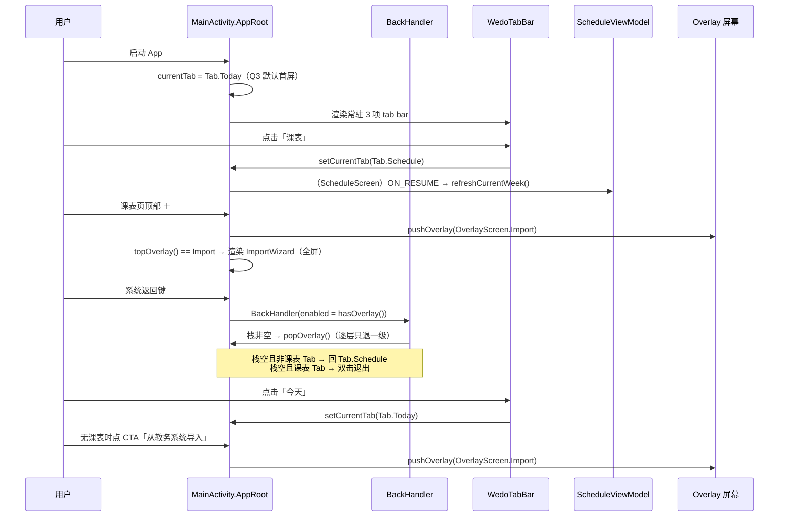
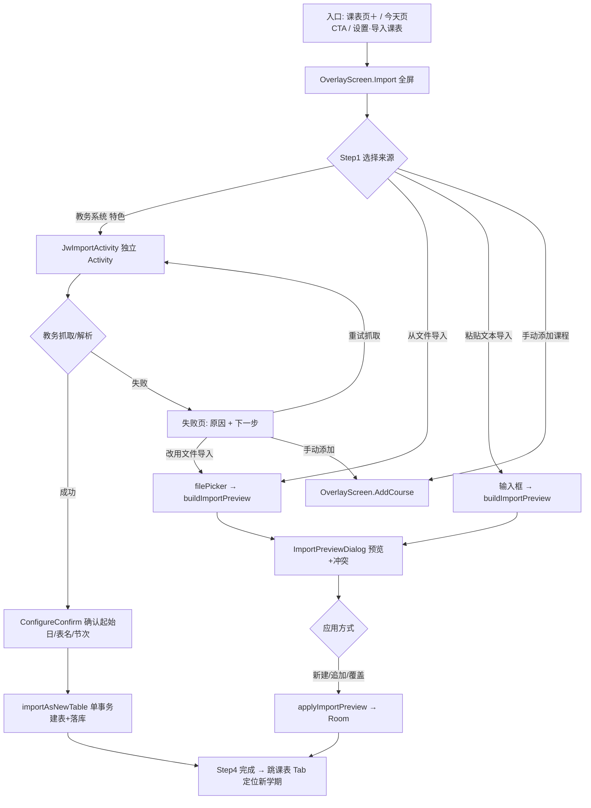
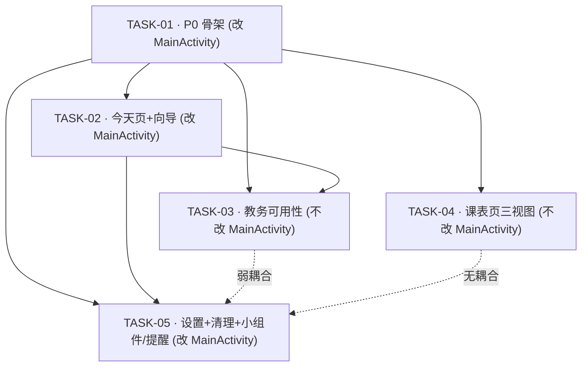

# wedo 课表 · V3 重设计 · 增量架构设计与任务分解

> 状态：**待实施** · 撰写：架构师 高见远
> 依据：`docs/PRD_V3_IMPLEMENTATION.md`（35 条需求）、`docs/DESIGN_V3_INTERACTION.md`、`docs/DESIGN_SPEC_V2.md`、`docs/PROJECT_HANDOFF.md`
> 工程：既有 Android 工程增量改造（根 `D:/AAAAA/ai/wedo`，Kotlin + Jetpack Compose，包名 `com.wedo.schedule`）
> 口径：**无真机 / 无模拟器 / 无 AVD**；验证 = 单测 + 源码契约测试。设计不得破坏既有 733 tests / 0 failures。

---

## 0. 结论速览（先读这一段）

1. **本轮不引入任何新依赖**（无 Navigation-Compose、无 Robolectric）。骨架重构在 `MainActivity.kt` 原地完成。
2. **`MainActivity.kt` 是全局唯一串行写入点** —— 只有 TASK-01 / TASK-02 / TASK-05 触碰它，三者必须按序串行；TASK-03 / TASK-04 不触碰，可与彼此并行。
3. **REQ-P4-02「覆盖页栈改标准导航」采用"达成语义目标、不推倒重写"的取舍**（详见 ADR-1）：现有 `List<OverlayScreen>` + push/pop 已是逐层退一级，验收标准已满足，本轮不为此引入导航库。
4. **白名单下沉会必然改红一条现有安全契约测试**（`WedoWebViewSecurityContractTest`），这是**设计内的破坏**，必须由 TASK-03 同步改写（详见 ADR-4 与该任务）。
5. **小组件 5→2 会必然改红三条现有测试**（`WidgetUpdaterWiringTest` / `WidgetVariantInfoTest` / `WidgetVariantRenderTest`），必须由 TASK-05 同步改写（详见 ADR-5）。
6. **共享代码 `WeekData` / `DayData` 必须保留**（`WeekGrid` 存活路径在用），只删 `TwoDayData` 及 WeekList/WeekView/TwoDay 专属的渲染函数。
7. **可滚动态（`ScrollStripService` + `pushScrollable` + `widget_scroll_*`）随 REQ-P4-04 一并移除**，Today 组件退化为"内容超容器即裁剪"的静态渲染（见 ADR-7）。

---

## 1. 实现方案总览（P0–P5 改造策略）

| 阶段 | 改造策略 | 关键技术决策 | 主要文件 |
|---|---|---|---|
| **P0 导航骨架** | 原地重构 `MainActivity.kt`：三 Tab 语义换轴、删 Dock、删下滑收起、加常驻 tab bar、返回键分层适配。**不动覆盖页栈实现** | 保留 `List<OverlayScreen>` 栈 + `rememberSaveable`；`LocalWedoCollapsed` 解耦为恒 `false` | `MainActivity.kt`、`ui/component/WedoTabBar.kt`(新)、`ui/component/WedoShell.kt`、`WedoWeekHeader.kt` |
| **P1 今天页** | 复用 `TodayScreen` 既有时间轴/冲突分栏/空态，新增倒计时卡与无课表全屏引导 | 周次读**客观事实**（`DateUtils.currentWeek(startDate, today)` 即时重算），不引入第二套语义；倒计时抽纯函数 | `ui/screen/today/TodayScreen.kt`、`util/NextClassDecider.kt`(新) |
| **P2 导入向导 + 教务可用性** | `ImportSheet`（底部 sheet）→ 全屏分步向导；教务失败页可操作化；白名单下沉数据层 | 抽出 `ImportFlow.kt` 承载既有解析/应用逻辑；白名单从 UI 常量迁到 `JwSchoolInfo` 字段 | `ui/screen/imports/ImportWizard.kt`(新)、`ImportFlow.kt`(新)、`JwSchoolInfo.kt`、`JwWebViewLoginScreen.kt`、`JwImportActivity.kt` |
| **P3 课表页三视图** | `ScheduleScreen` 加周/学期/课程分段控件；周标题→全屏周次选择器；课程视图接 `PinyinMatcher`；冲突加 `!` | 视图模式用 `rememberSaveable`（会话级持久，不落库）；搜索为纯函数 | `ScheduleScreen.kt`、`WedoWeekHeader.kt`、`WedoCourseCard.kt` |
| **P4 设置合并 + 清理** | `Manage`+`Mine` 合并为「设置」四组；删死代码/死资源/死服务 | 复用既有子屏作为 overlay 推入；删**不可达**管理屏，保留 **`android:configure` 目标**配置屏 | `WedoSettingsScreen.kt`、`MainActivity.kt`、大量删除 |
| **P5 小组件/提醒复活** | 小组件 5→2；启用存活 receiver；启用课前提醒；删每日提醒 | `ALL_WIDGET_VARIANTS` 10→4 单一事实来源；Manifest `enabled=true` | `WidgetVariantInfo.kt`、`AndroidManifest.xml`、widget 目录 |

**分层不变式**：教务导入链路（`JwImportActivity → SchoolSelectScreen → JwWebViewLoginScreen → JwImportViewModel.parseHtml → JwParserRegistry → JwNewZfParser → importAsNewTable` 单事务）在任何阶段不得破坏；本轮只做**可用性补强**（降级出口/白名单下沉/文案），不触碰安全与解析内核。

---

## 2. 关键架构决策与取舍（ADR）

### ADR-1 · `MainActivity.kt` 骨架重构范围（最大风险点）

**问题**：PRD REQ-P4-02 要求"8 个 `OverlayScreen` enum 的覆盖页栈改为**标准 push/pop 导航**"。现状：

- `Tab` enum（172–176）= `Schedule/Manage/Mine`
- `MainTabs`（378–404）三 Tab 分支
- `OverlayScreen` enum（178–180）+ `overlayScreenState` 栈（200–306），用 `if (topOverlay() == …) return` **瀑布式渲染** 8 个覆盖页
- `BackHandler` 分层（233–261）
- `nestedScroll` 收起联动（307–322）
- `WedoDock` 挂载（344–360）
- `ImportSheet` 入口（362–375）
- `editTableId` / `pendingNewTableId` / `previousDefaultTableId` 均为 `rememberSaveable`（215–217），承载旋转/进程恢复语义（REQ-P4-02 的隐性要求）

**候选方案**：

- **A. 引入 `androidx.navigation:navigation-compose`，全面改写为 NavHost**：语义最"标准"，但需新依赖；`NavBackStackEntry` 的 SavedState 语义与现有 `rememberSaveable(editingCourse==null → 丢栈)` 的**刻意安全降级**不同；无真机/无模拟器，无法验证旋转恢复与返回栈；风险面最大。
- **B. 判读"验收标准"而非"字面措辞"**：REQ-P4-02 的**可测验收**是"进出各页面返回行为一致（**每层只退一级**）"。现状（`pushOverlay` / `popOverlay` = `dropLast(1)`）**已经**满足；"栈遗留在主骨架"的表述与"逐层退一级"的验收**并不冲突**——`List<OverlayScreen>` 就是现成的栈。
- **C. 推倒为单变量 + 全量清空**：明确违反验收，排除。

**选择**：**B**。判定为 —— **现状的栈式实现已经满足「逐层退一级」的验收标准，因此不为重构而重构**。本轮 P0 只做与「导航语义换轴 + 移除 Dock/收起」直接相关的改动，**保留** `OverlayScreen` enum 与 `overlayScreenState` 栈、保留三处 `rememberSaveable`、保留 `BackHandler` 分层结构（仅把 `Tab` 判断换成新枚举）。

**理由**：

1. 契约测试（`ScheduleCurrentWeekWiringTest` 式的源码契约）是本项目唯一的验证手段；引入新框架会改变恢复语义，无法在本机证明无回归。
2. 现有栈式的注释（193–199）明确记录了"编辑会话不保存栈"是**有意的安全降级**（避免恢复成"新增课程"空表单造成重复加课）——这是设计资产，NavHost 会丢掉它。
3. REQ-P4-02 的**可测口径**已满足，重构的边际收益 < 风险。

**影响**：

- `MainActivity.kt` 改动**收敛**为：`Tab` enum 重写 / `MainTabs` 三分支 / 删除 Dock 挂载 / 删除 `collapsed`+`scrollConnection`+`nestedScroll` / 新增 `WedoTabBar` 挂载 / `BackHandler` 适配新 Tab / 新增 overlay 入口（向导、提醒）。
- **文档显式声明**：REQ-P4-02 以"保留栈式 + 逐层退一级 + 状态可恢复"为交付口径；**不**引入导航库。这一点写入 PRD 验收说明，避免工程师误会。

---

### ADR-2 · 移除浮动 Dock 与「下滑收起」联动

**问题**：移除 `WedoDock`（`WedoShell.kt:187`）挂载与 `AnimatedVisibility`（344–360）；删除 `scrollConnection`（310–322）与 `LocalWedoCollapsed`（`WedoDesign.kt:40`）的驱动；`WedoWeekHeader` 现消费 `LocalWedoCollapsed`（34–40）做 44/60dp 折叠。

**候选**：A. 直接删除 `LocalWedoCollapsed` 及其在 `WedoWeekHeader` 的用法（顶栏恒大字号）；B. 保留 `LocalWedoCollapsed` 但改为恒 `false` 提供，`WedoWeekHeader` 暂不改；C. 顶栏改为 `LargeTopAppBar` 原生滚动收起（P3 交付）。

**选择**：**B（P0）→ C（P3）**。P0 阶段删除 `scrollConnection` 与 `collapsed` 状态，`LocalWedoCollapsed` 仍以 `provides false` 提供（`WedoWeekHeader` 零改动即可编译），成本最低、回归面最小；P3 再由 REQ-P3-06 把课表页顶栏升级为大标题滚动收起（标准行为，与"下滑隐藏 tab bar"不同——HIG 允许**顶栏**收起，只禁止**隐藏 tab bar**）。

**影响**：`MainActivity.kt` 删除 ~20 行；`WedoShell.kt` 删除 `WedoDock` 函数；`WedoWeekHeader.kt` 的 `collapsed` 分支在 P0 恒走向 `false`。

---

### ADR-3 · `TodayScreen` 复活范围与周次语义对齐

**问题**：`TodayScreen.kt`（381 行）当前只被 import 未使用。其内部**已经**用 `DateUtils.currentWeek(it.startDate, today)` **即时重算**（69 行），不同于 `ScheduleScreen` 依赖 `state.currentWeek`。复活后须与 `ScheduleViewModel` 周次语义一致，不得制造第二套行为。

**已读懂的现有结构**：`TodayHeader`（日期/周次 chip/学期态）、`EmptyToday`（三态空文案）、`TodayCourseCard`（复用 `wedoCourseBlockColors` 淡底+左色条）、冲突分栏复用 `ConflictLayoutEngine.weekLaneRows`、`CourseDetailSheet` 复用。

**候选**：A. 全部重写；B. **保留复用 + 定点新增**（倒计时卡、无课表引导）。

**选择**：**B**。`TodayScreen` 的既有结构**已满足** REQ-P1-03（时间轴/冲突分栏）与 REQ-P1-04（三态空态）的绝大部分 —— 直接复用，只新增 REQ-P1-02（倒计时卡）与 REQ-P1-05（无课表全屏引导）。

**周次语义**（关键，写死为约束）：

- `TodayScreen` **继续**用 `DateUtils.currentWeek(startDate, today)` 即时重算 —— 这正是 `currentWeek`（客观事实）的定义，**与 `ScheduleScreen` 的 `state.currentWeek` 同源同函数**。
- **不涉及** `selectedWeek`（用户浏览位置）。今天页无"当前浏览周"概念，故不存在与 `selectedWeek` 混用风险。
- **不修改** `ScheduleViewModel` 的 `currentWeek`/`selectedWeek` 职责划分（铁律 3）。

**影响**：`TodayScreen` 增量改造；新增 `util/NextClassDecider.kt`（纯函数，可单测）。

---

### ADR-4 · 白名单下沉数据层（REQ-P2-04 / P2-05）

**问题**：`JwWebViewLoginScreen.kt` 62–70 硬编码 `VERIFIED_AUTH_HOSTS` / `VERIFIED_JS_BRIDGE_HOSTS`；加学校须改 UI 常量，易漏改。

**候选**：
- A. 下沉为 `JwSchoolInfo` 字段，UI 从数据读取。
- B. 下沉为独立 `object JwHostAllowlist`。

**选择**：**A**。`JwSchoolInfo` 新增两个 `List<String>` 字段；`defaultWedoSchools()` 填 JLJU 三域名；`JwWebViewLoginScreen` 内 `val VERIFIED_AUTH_HOSTS = school.authHosts.toSet()` / `val VERIFIED_JS_BRIDGE_HOSTS = school.jsBridgeHosts.toSet()`（**保留这两个局部名**，最小化 diff 且维持安全契约测试的结构断言命中）。

**契约与安全**：
- **严禁通配**：新增 `JwWhitelistContractTest` 遍历 `defaultWedoSchools()`，断言每校 `authHosts`、`jsBridgeHosts` 非空且不含 `*` / `*.`，并逐字断言 JLJU = `{lxr, cas}` / `{jwxt}`。
- **对现有测试的影响（必须处理）**：`WedoWebViewSecurityContractTest` 断言 `source.contains("jwxt.jlju.edu.cn")` / `"lxr.jlju.edu.cn"` / `"cas.jlju.edu.cn"`（31–47 行）——下沉后这些字面量**移出** UI 文件，断言必然 FAIL。**设计内破坏**：TASK-03 必须改写该测试：
  - 保留在 UI 文件上的**结构/安全**断言：`handler.cancel()` / 无 `proceed()`；`MIXED_CONTENT_NEVER_ALLOW`；`allowFileAccess=false`；`allowContentAccess=false`；`UUID.randomUUID()`；`finishedHost !in VERIFIED_JS_BRIDGE_HOSTS`；`targetHost in VERIFIED_AUTH_HOSTS`；`targetHost !in VERIFIED_JS_BRIDGE_HOSTS`；`addJavascriptInterface(bridge, bridgeName)` + `view.reload()`；`removeJavascriptInterface(bridgeName)`；`target.scheme == "https"`；日志不打印完整 URL。
  - 把**域名字面量**断言迁到新的 `JwWhitelistContractTest`（数据层）。

**影响**：`JwSchoolInfo.kt`（+字段）、`JwImportViewModel.kt`（填值）、`JwWebViewLoginScreen.kt`（读值）、`WedoWebViewSecurityContractTest.kt`（改写）、新增 `JwWhitelistContractTest.kt`。JLJU 三域名语义**逐字不变**。

---

### ADR-5 · 小组件 5→2 的精确删除面

**问题**：删除 `WeekList` / `WeekView` / `TwoDay` 三种（含大小变体 = 6 receiver）；牵连 `WidgetBitmapRenderers` / `WidgetVariant` / `WidgetVariantInfo` / `WidgetUpdater` / `WidgetManagementViewModel` / `WidgetBindingStore` / Manifest / 资源 / 测试。

**精确删除清单（生产代码）**：

| 类别 | 删除 |
|---|---|
| Receiver 实现 | `WeekListWidget.kt`、`WeekListSmallWidgetReceiver.kt`、`WeekViewWidget.kt`、`WeekViewSmallWidgetReceiver.kt`、`TwoDayWidget.kt`、`TwoDaySmallWidgetReceiver.kt` |
| 渲染函数（`WidgetBitmapRenderers.kt` 内） | `renderTwoDay` + `renderTwoDayRegular` + `renderTwoDayCompact` + `twoDayContentHeightDp` + `twoDayCompactTexts`(×2 重载)、`renderWeekList` + `renderWeekListRegular` + `renderWeekListCompact` + `weekListContentHeightDp` + `weekListCompactTexts`(×2)、`renderWeekView` + `renderWeekViewRegular` + `renderWeekViewCompact` + `weekViewCompactColumns` |
| 数据类 | `TwoDayData`（`WidgetContent.kt`） |
| Manifest | 6 个 receiver 声明（119–221） |
| 资源 | `res/xml/{week_list,week_list_small,week_view,week_view_small,twoday,twoday_small}_widget_info.xml`；`res/drawable*/widget_preview_{weeklist,weeklist_small,weekview,weekview_small,twoday,twoday_small}.png` |
| 字符串（6 语言） | `widget_week_list_label`、`widget_week_list_small_label`、`widget_week_view_label`、`widget_week_view_small_label`、`widget_twoday_label`、`widget_twoday_small_label` |

**必须保留的共享代码**：

| 保留项 | 理由 |
|---|---|
| `WidgetData`（data class） | Today / WeekGrid 共用 |
| `WeekData`、`DayData`（data class） | **`WeekGridWidgetProvider.loadWeekData` 仍在用**（不能删） |
| `renderToday` / `renderTodayCompact` / `renderTodayRegular` / `todayCompactTexts` / `todayContentHeightDp` / `drawCourse` / `ellipsize` / `scheme` | Today 存活 |
| `WeekGridWidgetProvider` 全部 + `weekGridMinimumTodayData` / `courseMetaLines` / `renderBitmap` / `loadWeekData` | WeekGrid 存活 |
| `WidgetVariant`（enum REGULAR/SMALL） | 两个存活种类均保留大小变体（Q2 已拍板 4 个 receiver） |
| `WidgetBindingStore` / `WidgetBindingCore` / `WidgetTableResolver` / `WidgetUpdater` / `WidgetUpdateWorker` / `RemoteViewsWidgetHelper.renderAndPush` / `computeSizeDp` | 存活路径共享 |
| `WidgetVariantInfo` + `ALL_WIDGET_VARIANTS` | 单一事实来源，**内容改为 4 条** |
| `TodaySmallWidgetReceiver` / `WeekGridSmallWidgetProvider` | 存活（今日·小 / 周网格·小） |

**连带处理**：
- `WidgetVariantInfo.ALL_WIDGET_VARIANTS`：10 → **4**（`WeekGridWidgetProvider`、`WeekGridSmallWidgetProvider`、`TodayWidgetReceiver`、`TodaySmallWidgetReceiver`）。
- `PinWidgetActivity.kt`（30–33）：`when(type)` 去掉 `"twoday"` / `"weeklist"` 两分支。
- `WidgetRenderActivity.kt`（调试用，`enabled=false`）：去掉 `"twoday"` / `"weeklist"` 两个渲染分支（否则引用已删函数 → **编译失败**）。
- `WidgetUpdater.kt` / `WidgetUpdateWorker.kt`：仅注释里的"10 个"改为"4 个"。

**必须同步改写的现有测试**（设计内破坏）：

| 测试 | 现状 | 改为 |
|---|---|---|
| `WidgetUpdaterWiringTest` | 断言 `receivers.size == 10` 且含全部 10 类 | 断言 == **4** 且恰好含 4 个存活类 |
| `WidgetVariantInfoTest` | 断言 == 10；断言 5 种 kind 各 base+small | 断言 == **4**；断言 2 种 kind（Today/WeekGrid）各 base+small |
| `WidgetVariantRenderTest` | 含 TwoDay/WeekList/WeekView SMALL 断言（155–156、276–277、334–335） | 删除这些方法的对应断言，保留 Today/WeekGrid |
| `WidgetBitmapLifecycleTest` | 检查 `RemoteViewsWidgetHelper` / `WeekGridWidgetProvider` 的 recycle 守卫 | **不改**（两个文件都保留） |

**影响**：见 §3 文件清单与 TASK-05。

---

### ADR-6 · 死资源删除（REQ-P4-03）

**问题**：`import_qr` / `schedule_share_table` 在两处代码中 `R.string.*` **零引用**（已 grep 确认），但定义存在于 6 个语言目录。

**订正（TASK-01 主理人决定）**：`tab_today` **不删** —— V3 重设计后「今天」页复活，该键正好由「死资源」转为**存活资源**（新 `Tab.Today` 的标签）。故本节死资源清单由三键缩减为**两键**（`import_qr` / `schedule_share_table`）。相应地，`tab_today` 的**标签值**可按需微调（本次中文由「今日」改为「今天」），`tab_manage` / `tab_mine` 字符串保留。

**选择**：6 个语言目录**同步删除**（`values`、`values-en`、`values-es`、`values-ja`、`values-zh-rCN`、`values-zh-rTW`）。

**安全校验**：`StringsKeyParityTest` 只断言"6 目录存在 + 可读 + 两个 `settings_course_colorless*` 键存在"，**不**做全键集相等断言 → 删键**不会**改红该测试。但仍要求 6 语言一致删除（维护习惯）。

**影响**：`res/values*/strings.xml` × 6；新增 `DeadResourceContractTest`（断言**两键** `import_qr` / `schedule_share_table` 在 6 文件均不存在、且全仓无 `R.string.<该键>` 引用）。

---

### ADR-7 · 服务与屏幕删除（REQ-P4-04 / P4-05）+ 可滚动态移除

**问题**：删除 `FluidCloudService` / `ScrollStripService`（Manifest 296–307）；`WidgetManagementScreen` / `WidgetEditScreen` 的处理。

**已查明的真实调用关系（与 PRD 表述有出入，据实修正）**：

1. `ScrollStripService` 仅被 `RemoteViewsWidgetHelper.pushScrollable` 引用；`pushScrollable` 被 `TodayWidget` 及 3 个待删 receiver 引用。而 Manifest 中 `ScrollStripService` `enabled=false` → 系统无法 bind → **可滚动态在产品里本就不可用**。
2. `FluidCloudService` 被 `CourseNotificationScheduler.ensureActiveFluidCloud()`（`WidgetUpdateWorker` 调用）与 `ReminderScreen`「流体云/超级岛」开关（`setBeforeClassFluidEnabled`）牵动。
3. `WidgetManagementScreen`（`ui/screen/widget/`）**全仓无调用者** → 真死代码；其 `WidgetManagementViewModel` 也仅被它使用。
4. `WidgetEditScreen` **并非不可达** —— 它被 `WidgetConfigureActivity`（re-edit 分支，74 行）调用；而 `WidgetConfigureActivity` 是 4 个存活 `*_widget_info.xml` 声明的 `android:configure=".widget.WidgetConfigureActivity"` 目标（当前 Manifest `enabled=false`）。一旦 REQ-P5-02 启用组件，该配置页即为**系统可达**入口，`WidgetEditScreen` 随之可达。

**选择**：

- **删除** `ScrollStripService.kt` + `RemoteViewsWidgetHelper.pushScrollable()` + `TodayWidget` 的可滚动分支 → Today 组件**统一走 `renderAndPush` 静态渲染**（内容超容器即裁剪，不再"壳图+条带"）。同时删除 `res/layout/widget_scroll_{today,twoday,weeklist}.xml` 与 `widget_scroll_row.xml`（可滚动态整体下线）。
- **删除** `FluidCloudService.kt` + Manifest service 声明；从 `WidgetUpdateWorker` 删除 `ensureActiveFluidCloud()` 调用；从 `ReminderScreen` **移除「流体云 / 超级岛」整段 UI**（其唯一后端被删，保留开关即空转）。⚠️ 见 §8 待明确。
- **删除** `WidgetManagementScreen.kt` + `WidgetManagementViewModel.kt`（真死代码）。
- **保留** `WidgetConfigureActivity` + `WidgetEditScreen` + `WidgetEditViewModel` + `WidgetEditCore` + `WidgetEditSection` + `WidgetEditScheduleSection`（`android:configure` 目标链，kind-agnostic，无需为"2 种"改写）；`WidgetConfigureActivity` 在 REQ-P5-02 一并 `enabled=true`。仅更新其 KDoc 里"9 widget receivers"过时措辞。
- **保留** `WidgetEditCoreTest`（被测代码仍存活）。

**理由**：以"是否真可达"为唯一判据删除，而非照搬 PRD 的"不可达"措辞；避免删掉系统配置入口导致"小组件添加流程"不可用（REQ-P5-02 的隐含前提）。

**影响**：`RemoteViewsWidgetHelper.kt`、`TodayWidget.kt`、`WidgetUpdateWorker.kt`、`ReminderScreen.kt`、`AndroidManifest.xml`、`WidgetConfigureActivity`（enable）、layout 资源；`WidgetBitmapLifecycleTest` **不改**（保留文件的守卫注释仍在）。

---

### ADR-8 · 设置页合并（REQ-P4-01）与 导入向导（REQ-P2-01）

**设置页**：`Manage`+`Mine` 合并为「设置」四组。现状 Tab.Mine 渲染的是 `WedoSettingsScreen`（`MineScreen` 实为**死代码**，无调用者），Tab.Manage 渲染 `ManagementPage`。

**选择**：**复用 `WedoSettingsScreen.kt` 作为「设置」Tab 入口并重排为四组**（课表/显示/通知/关于），把原 `ManagementPage` 的入口（导入/新建/手动/编辑当前表/全部课表/导出）**并入「课表」组**；子屏继续以 overlay 推入（`AllTables`/`Export`/`Theme`/`General`/`About`/`License`/`AddCourse`/`EditTable`）。**新增** overlay 项：`Reminder`（上课前提醒，REQ-P5-03 暴露）与 `Import`（全屏导入向导）。**删除** `MineScreen.kt` 与 `ManagementPage.kt`（能力已并入设置内，避免重复入口）。

**导入向导**：`ImportSheet`（`ModalBottomSheet`）→ 全屏分步 `ImportWizard`（Step1 来源 → Step2 来源专属 → Step3 预览+冲突 → Step4 完成），步骤间用水平滑动转场（`HorizontalPager`，300ms，`display.motion` 约束）。既有 `buildImportPreview` / `applyImportPreview` / `ImportPreviewDialog` / 文件选择器 / 粘贴框 逻辑**抽到非 UI 的 `ImportFlow.kt`** 复用，`ImportWizard` 只负责分步 UI。

**影响**：`WedoSettingsScreen.kt`、`MainActivity.kt`（MainTabs Settings 分支 + 两个 overlay）、新增 `ImportWizard.kt` / `ImportFlow.kt`、删除 `MineScreen.kt` / `ManagementPage.kt`、`ImportSheet.kt`（逻辑迁出后删除或降级为薄封装——决策：**删除**，入口统一到向导）。

---

## 3. 文件清单

> 相对路径均以 `D:/AAAAA/ai/wedo/` 为根。

### 3.1 新增

| 相对路径 | 说明 |
|---|---|
| `app/src/main/java/com/wedo/schedule/ui/component/WedoTabBar.kt` | 底部常驻 tab bar（3 项，Liquid Glass 控件层，填充态图标，`navigationBarsPadding`） |
| `app/src/main/java/com/wedo/schedule/util/NextClassDecider.kt` | 倒计时纯函数：给定 now + 当日课程 + timeJson → 下一节课 / 剩余分钟 |
| `app/src/main/java/com/wedo/schedule/ui/screen/imports/ImportWizard.kt` | 全屏分步导入向导（Step1–4，水平滑动） |
| `app/src/main/java/com/wedo/schedule/ui/screen/imports/ImportFlow.kt` | 从 `ImportSheet` 抽出的解析/预览/应用纯逻辑（`buildImportPreview` / `applyImportPreview` / `ImportApplyMode` 等） |
| `app/src/main/java/com/wedo/schedule/ui/screen/schedule/WeekPicker.kt` | 全屏周次选择器（周次网格 + 学期进度条 + 回到本周） |
| `app/src/main/java/com/wedo/schedule/ui/screen/schedule/SemesterOverview.kt` | 学期视图（1..maxWeek 纵向概览 + 当前周高亮） |
| `app/src/main/java/com/wedo/schedule/ui/screen/schedule/CourseListView.kt` | 课程视图（按课名聚合 + 搜索框，接 `PinyinMatcher`） |
| `app/src/test/java/com/wedo/schedule/util/NextClassDeciderTest.kt` | 倒计时纯函数单测 |
| `app/src/test/java/com/wedo/schedule/data/jw/JwWhitelistContractTest.kt` | 白名单契约：每校非空、非通配；JLJU 三域名逐字 |
| `app/src/test/java/com/wedo/schedule/ui/screen/today/TodayScreenWiringTest.kt` | 接线契约：TodayScreen 接入 Tab.Today、倒计时卡存在、空态三态分流 |
| `app/src/test/java/com/wedo/schedule/ui/screen/imports/ImportWizardWiringTest.kt` | 接线契约：全屏向导 4 步可达、水平滑动转场、失败页有 2 按钮 |
| `app/src/test/java/com/wedo/schedule/ui/screen/schedule/CourseSearchTest.kt` | 课程搜索纯函数单测（中文包含 + 拼音首字母） |
| `app/src/test/java/com/wedo/schedule/widget/WidgetEnabledManifestContractTest.kt` | 契约：存活 4 receiver + 课前提醒 receiver `enabled=true`；待删 receiver 不存在 |
| `app/src/test/java/com/wedo/schedule/DeadResourceContractTest.kt` | 契约：`import_qr`/`schedule_share_table`/`tab_today` 在 6 语言不存在且零引用 |

### 3.2 修改

| 相对路径 | 一句话说明 |
|---|---|
| `app/src/main/java/com/wedo/schedule/MainActivity.kt` | **核心**：Tab 重写、移除 Dock/收起、挂载 WedoTabBar、接 Today/向导/提醒 overlay、返回键适配 |
| `app/src/main/java/com/wedo/schedule/ui/component/WedoShell.kt` | 删除 `WedoDock` 函数（187 起） |
| `app/src/main/java/com/wedo/schedule/ui/theme/WedoDesign.kt` | `LocalWedoCollapsed` 标注为 P0 恒 `false`（P3 由顶栏大标题接手） |
| `app/src/main/java/com/wedo/schedule/ui/screen/schedule/WedoWeekHeader.kt` | P0 解耦折叠；P3 改全屏周次选择器 + 大标题/`⋯`/`＋` |
| `app/src/main/java/com/wedo/schedule/ui/screen/today/TodayScreen.kt` | 复活接入 Tab.Today；新增倒计时卡与无课表全屏引导 |
| `app/src/main/java/com/wedo/schedule/ui/screen/schedule/ScheduleScreen.kt` | 加三段分段控件 + 学期/课程视图 + 搜索；冲突 `!` |
| `app/src/main/java/com/wedo/schedule/ui/component/WedoCourseCard.kt` | 冲突课程块加 `!` 符号 + 无障碍语义 |
| `app/src/main/java/com/wedo/schedule/data/jw/JwSchoolInfo.kt` | 新增 `authHosts` / `jsBridgeHosts` 字段 |
| `app/src/main/java/com/wedo/schedule/data/jw/JwImportViewModel.kt` | `defaultWedoSchools()` 填 JLJU 三域名白名单 |
| `app/src/main/java/com/wedo/schedule/ui/screen/imports/JwWebViewLoginScreen.kt` | 白名单改从 `school.*Hosts` 读取（保留局部名） |
| `app/src/main/java/com/wedo/schedule/ui/screen/imports/JwImportActivity.kt` | 失败页 2 按钮 + `Stage` 回退上一有效 + 重试抓取 + 学期引导文案 |
| `app/src/main/java/com/wedo/schedule/data/jw/JwParseDiagnostics.kt` | 文案改「原因 + 下一步动作」；`EMPTY_SEMESTER` 加确认学期指引 |
| `app/src/main/java/com/wedo/schedule/ui/screen/mine/WedoSettingsScreen.kt` | 重排为四组设置（课表/显示/通知/关于） |
| `app/src/main/java/com/wedo/schedule/widget/WidgetVariantInfo.kt` | `ALL_WIDGET_VARIANTS` 10 → 4 |
| `app/src/main/java/com/wedo/schedule/widget/PinWidgetActivity.kt` | `when(type)` 去掉 twoday/weeklist 分支 |
| `app/src/main/java/com/wedo/schedule/widget/WidgetRenderActivity.kt` | 去掉 twoday/weeklist 渲染分支 |
| `app/src/main/java/com/wedo/schedule/widget/RemoteViewsWidgetHelper.kt` | 删除 `pushScrollable`（连同 `ScrollStripService` 引用） |
| `app/src/main/java/com/wedo/schedule/widget/TodayWidget.kt` | 删除可滚动分支，统一静态渲染 |
| `app/src/main/java/com/wedo/schedule/widget/WidgetUpdateWorker.kt` | 删除 `ensureActiveFluidCloud()` 调用 |
| `app/src/main/java/com/wedo/schedule/ui/screen/mine/ReminderScreen.kt` | 移除「流体云 / 超级岛」UI 段（后端已删） |
| `app/src/main/java/com/wedo/schedule/widget/WidgetConfigureActivity.kt` | Manifest 启用；KDoc 更新（配置流程对存活 2 种通用） |
| `app/src/main/AndroidManifest.xml` | 删 6 receiver + 2 service + 2 notif receiver；启用 4 receiver + 3 notif receiver + WidgetConfigureActivity |
| `app/src/main/res/values/strings.xml` + 5 语言 | 删死资源三键 + 删 3 种小组件标签键 |
| `app/src/test/java/com/wedo/schedule/ui/screen/imports/WedoWebViewSecurityContractTest.kt` | 域名字面量断言迁出；UI 侧结构/安全断言保留 |
| `app/src/test/java/com/wedo/schedule/widget/WidgetUpdaterWiringTest.kt` | 10 → 4 |
| `app/src/test/java/com/wedo/schedule/widget/WidgetVariantInfoTest.kt` | 10 → 4；kind 2 种 |
| `app/src/test/java/com/wedo/schedule/widget/WidgetVariantRenderTest.kt` | 删 WeekList/WeekView/TwoDay 断言 |

### 3.3 删除

| 相对路径 | 原因 |
|---|---|
| `app/src/main/java/com/wedo/schedule/widget/WeekListWidget.kt` | REQ-P5-01 |
| `app/src/main/java/com/wedo/schedule/widget/WeekListSmallWidgetReceiver.kt` | REQ-P5-01 |
| `app/src/main/java/com/wedo/schedule/widget/WeekViewWidget.kt` | REQ-P5-01 |
| `app/src/main/java/com/wedo/schedule/widget/WeekViewSmallWidgetReceiver.kt` | REQ-P5-01 |
| `app/src/main/java/com/wedo/schedule/widget/TwoDayWidget.kt` | REQ-P5-01 |
| `app/src/main/java/com/wedo/schedule/widget/TwoDaySmallWidgetReceiver.kt` | REQ-P5-01 |
| `app/src/main/java/com/wedo/schedule/widget/ScrollStripService.kt` | REQ-P4-04 |
| `app/src/main/java/com/wedo/schedule/widget/notification/FluidCloudService.kt` | REQ-P4-04 |
| `app/src/main/java/com/wedo/schedule/ui/screen/widget/WidgetManagementScreen.kt` | REQ-P4-05（真不可达） |
| `app/src/main/java/com/wedo/schedule/widget/WidgetManagementViewModel.kt` | 仅被上者使用 |
| `app/src/main/java/com/wedo/schedule/ui/screen/mine/MineScreen.kt` | 死代码（无调用者），能力并入设置 |
| `app/src/main/java/com/wedo/schedule/ui/screen/manage/ManagementPage.kt` | 能力并入设置组 |
| `app/src/main/java/com/wedo/schedule/ui/screen/imports/ImportSheet.kt` | 逻辑迁入 `ImportFlow.kt`，入口统一到向导 |
| `app/src/main/java/com/wedo/schedule/widget/notification/DailyNotifyReceiver`（`CourseNotificationScheduler.kt` 内类） | REQ-P5-04（删除类 + Manifest 声明；同文件保留其余 receiver） |
| `app/src/main/res/xml/{week_list,week_list_small,week_view,week_view_small,twoday,twoday_small}_widget_info.xml` | 随 3 种小组件删除 |
| `app/src/main/res/drawable*/widget_preview_{weeklist,weeklist_small,weekview,weekview_small,twoday,twoday_small}.png` | 同上 |
| `app/src/main/res/layout/widget_scroll_{today,twoday,weeklist}.xml`、`widget_scroll_row.xml` | 可滚动态下线 |

---

## 4. 数据结构与接口（契约级，可照写）

### 4.1 导航骨架

```kotlin
// MainActivity.kt —— Tab 换轴（填充态图标）
private enum class Tab(val labelRes: Int, val icon: ImageVector) {
    Today(R.string.tab_today, Icons.Filled.Today),              // 默认首屏（Q3），复用 tab_today
    Schedule(R.string.tab_schedule, Icons.Filled.CalendarMonth),
    Settings(R.string.tab_settings, Icons.Filled.Settings),     // tab_settings 需新增（6 语言）
}

// OverlayScreen 保留原 8 项，新增 2 项：
private enum class OverlayScreen {
    AddCourse, AllTables, EditTable, Theme, General, Export, About, License,
    Reminder,   // REQ-P5-03 上课前提醒入口
    Import,     // REQ-P2-01 全屏导入向导
}
```

> 说明：`tab_today`（**复活复用**，非新增；标签值可微调）、`tab_manage` / `tab_mine` 字符串**保留**（不做全仓删除，避免误伤）；代码仅新增引用 `tab_settings`（需新增，6 语言）。`tab_today` 不再是死资源。

```kotlin
// ui/component/WedoTabBar.kt
@Composable
fun WedoTabBar(
    current: Tab,
    onSelect: (Tab) -> Unit,
    modifier: Modifier = Modifier,
)
```

### 4.2 今天页 / 倒计时

```kotlin
// util/NextClassDecider.kt —— 纯函数（无 Android 依赖，纯 JVM 可测）
data class NextClass(
    val course: CourseEntity,
    val startTime: LocalTime,   // 来自 timeJson 或 course.ownTime
    val endTime: LocalTime,
    val minutesUntilStart: Long, // now → start 的分钟数；已在进行中为负数语义见下
    val inProgress: Boolean      // now ∈ [start, end]
)

object NextClassDecider {
    /** 用于 @Composable 每分钟刷新：返回「正在上的课」优先，否则「下一节尚未开始」的课；当天已无课返回 null。 */
    fun decide(courses: List<CourseEntity>, now: LocalDateTime, timeJson: String): NextClass?
}
```

- `TodayScreen(onOpenImport: () -> Unit, onEditCourse: (CourseEntity) -> Unit, viewModel: ScheduleViewModel)`
- 倒计时卡每 ≤60s 刷新：`LaunchedEffect { while(true){ now = LocalDateTime.now(); delay(60_000) } }`。

### 4.3 教务白名单

```kotlin
// data/jw/JwSchoolInfo.kt（新增字段，默认空，向后兼容）
data class JwSchoolInfo(
    val sortKey: String,
    val name: String,
    val url: String = "",
    val type: String? = null,
    val status: String = STATUS_SUPPORTED,
    val aliases: List<String> = emptyList(),
    val sortKeyFull: String = "",
    val enableFetch: Boolean = false,
    /** 允许渲染登录 UI 但**不装 JS Bridge** 的认证主机（严禁通配）。 */
    val authHosts: List<String> = emptyList(),
    /** 允许安装 JS Bridge 的教务主机（严禁通配）。 */
    val jsBridgeHosts: List<String> = emptyList(),
)
```

```kotlin
// data/jw/JwImportViewModel.kt —— defaultWedoSchools() JLJU 填值
JwSchoolInfo(
    sortKey = "J", sortKeyFull = "jilinjianzhudaxue", name = "吉林建筑大学",
    url = "https://jwxt.jlju.edu.cn/sso/hnyyxyiotlogin",
    type = JwProtocol.TYPE_ZF_NEW, status = JwSchoolInfo.STATUS_SUPPORTED,
    aliases = listOf("吉建大", "JLJU"), enableFetch = true,
    authHosts = listOf("lxr.jlju.edu.cn", "cas.jlju.edu.cn"),   // 逐字不变
    jsBridgeHosts = listOf("jwxt.jlju.edu.cn"),                 // 逐字不变
)
```

```kotlin
// ui/screen/imports/JwWebViewLoginScreen.kt（局部名保留，供安全契约命中）
val VERIFIED_AUTH_HOSTS: Set<String> = school.authHosts.toSet()
val VERIFIED_JS_BRIDGE_HOSTS: Set<String> = school.jsBridgeHosts.toSet()
```

### 4.4 导入向导

```kotlin
// ui/screen/imports/ImportWizard.kt
enum class ImportStep { SOURCE, SOURCE_DETAIL, PREVIEW, DONE }
enum class ImportSource { JW, FILE, TEXT, MANUAL }

@Composable
fun ImportWizard(
    onDismiss: () -> Unit,
    onFinish: () -> Unit,          // Step4 → 跳课表 Tab 并定位新学期
    onManualAdd: () -> Unit,       // 手动添加 → overlay AddCourse
    viewModel: ScheduleViewModel,
)
```

```kotlin
// ui/screen/imports/ImportFlow.kt —— 从 ImportSheet 抽出的可复用逻辑（非 @Composable）
internal enum class ImportApplyMode { ReplaceCurrent, ImportAsNew, AppendNonConflict, AppendAsNew, AppendAll }
internal data class ImportPreview(/* 原样迁移 */)
internal suspend fun buildImportPreview(text: String, state: ScheduleState, context: Context, onError: (String)->Unit): ImportPreview?
internal suspend fun applyImportPreview(/* 原样迁移 */)
```

### 4.5 课表页三视图

```kotlin
// ui/screen/schedule/ScheduleScreen.kt
private enum class ScheduleViewMode { WEEK, SEMESTER, COURSE }   // rememberSaveable 持久于会话
// 分段控件：SegmentedSwitcher（已存在于 ui/component）
```

```kotlin
// ui/screen/schedule/CourseListView.kt —— 课程聚合（纯函数便于单测）
data class CourseSummary(
    val courseName: String,
    val groupId: String,
    val teacher: String,
    val rooms: List<String>,
    val sessions: List<CourseEntity>,
)
fun aggregateCourses(courses: List<CourseEntity>): List<CourseSummary>   // 按 courseName 聚合
fun filterCourses(list: List<CourseSummary>, query: String): List<CourseSummary> // PinyinMatcher.match(name, sortKey="", query)
```

### 4.6 小组件存活集合

```kotlin
// widget/WidgetVariantInfo.kt —— 4 条（单一事实来源）
val ALL_WIDGET_VARIANTS: List<WidgetVariantInfo> = listOf(
    WidgetVariantInfo(WeekGridWidgetProvider::class.java,       R.string.widget_week_grid_label),
    WidgetVariantInfo(WeekGridSmallWidgetProvider::class.java,  R.string.widget_week_grid_small_label),
    WidgetVariantInfo(TodayWidgetReceiver::class.java,          R.string.widget_today_label),
    WidgetVariantInfo(TodaySmallWidgetReceiver::class.java,     R.string.widget_today_small_label),
)
```

---

## 5. 程序调用流程（Mermaid）

### 5.1 新导航骨架（含覆盖页栈与返回键）



### 5.2 导入向导主流程



---

## 6. 任务列表（有序 · 含依赖 · 按实现顺序）

> **`MainActivity.kt` 串行约束（关键）**：只有 TASK-01 / TASK-02 / TASK-05 触碰 `MainActivity.kt`，三者**必须串行**。TASK-03 / TASK-04 不触碰，可与彼此并行。
> 每个任务**完成即验证**，按"可独立编译通过"切分，便于分批提交。
> 关于模板"第一个任务=项目基础设施"：本项目为**既有工程**，无新增依赖、无新脚手架；故把 TASK-01 定义为"构建基线校验 + P0 骨架前置（入口文件 `MainActivity.kt` + 新增组件）"，等价承担基础设施职责。

### TASK-01 · P0 导航骨架重构（全局前置）

- **涉及文件**：`MainActivity.kt`、`ui/component/WedoTabBar.kt`(新)、`ui/component/WedoShell.kt`、`ui/theme/WedoDesign.kt`、`ui/screen/schedule/WedoWeekHeader.kt`、`res/values*/strings.xml`（复用 `tab_today`、新增 `tab_settings` 6 语言）
- **触碰 `MainActivity.kt`**：✅ **是**
- **内容**：`Tab` 枚举三态换轴（默认 `Today`）；`MainTabs` 三分支（`Settings` 暂复用 `WedoSettingsScreen` 的旧签名过渡）；删除 `WedoDock` 挂载 + `AnimatedVisibility`；删除 `collapsed`/`scrollConnection`/`nestedScroll`；`LocalWedoCollapsed` 提供恒 `false`；挂载 `WedoTabBar`；`BackHandler` 三分支适配新 Tab；`LocalNavExtraBottomPadding` 适配 tab bar 高度。
- **依赖**：无
- **优先级**：P0
- **完成即验证**：`JAVA_HOME="D:/Program Files/Android/Android Studio/jbr" ./gradlew :app:compileDebugKotlin`

### TASK-02 · P1 今天页 + P2 导入向导入口

- **涉及文件**：`ui/screen/today/TodayScreen.kt`、`util/NextClassDecider.kt`(新)、`ui/screen/imports/ImportWizard.kt`(新)、`ui/screen/imports/ImportFlow.kt`(新)、`MainActivity.kt`（接 Tab.Today、`OverlayScreen.Import`、Today CTA、＋）、`test/.../NextClassDeciderTest.kt`(新)、`test/.../TodayScreenWiringTest.kt`(新)、`test/.../ImportWizardWiringTest.kt`(新)
- **触碰 `MainActivity.kt`**：✅ **是**
- **内容**：`TodayScreen` 增倒计时卡（REQ-P1-02）与无课表全屏引导 CTA（REQ-P1-05）；复用时间轴/冲突分栏/三态空态（REQ-P1-03/04）；`ImportWizard` 四步水平滑动骨架 + `ImportFlow` 逻辑迁移；`+` 与今天页 CTA 均入向导。
- **依赖**：TASK-01
- **优先级**：P0（今天页为最高频）
- **完成即验证**：`./gradlew :app:compileDebugKotlin` + `./gradlew :app:testDebugUnitTest`

### TASK-03 · P2 教务导入可用性补强

- **涉及文件**：`data/jw/JwSchoolInfo.kt`、`data/jw/JwImportViewModel.kt`、`ui/screen/imports/JwWebViewLoginScreen.kt`、`ui/screen/imports/JwImportActivity.kt`、`data/jw/JwParseDiagnostics.kt`、`test/.../JwWhitelistContractTest.kt`(新)、`test/.../WedoWebViewSecurityContractTest.kt`（**改写**）
- **触碰 `MainActivity.kt`**：❌ 否
- **内容**：白名单下沉（REQ-P2-04）+ 契约测试（REQ-P2-05）；失败页 2 按钮（REQ-P2-03）+ 重试抓取（REQ-P2-07）+ 学期引导（REQ-P2-08）；`Stage` 回退上一有效（REQ-P2-06）。**严禁通配**；SSL `cancel()` 与"不回显响应内容"约束不变。
- **依赖**：TASK-01（编译基线）；与 TASK-02 有弱耦合（失败页"改用文件导入"跳向导，见 `ImportWizard` 入参）→ **实际排在 TASK-02 之后**
- **优先级**：P0（特色功能可用性）
- **完成即验证**：`./gradlew :app:testDebugUnitTest`（重点：`JwWhitelistContractTest`、`WedoWebViewSecurityContractTest`、既有 `JwNewZfParserTest`/`JlJuParserTest` 全绿）

### TASK-04 · P3 课表页三视图 + 全屏周次选择器 + 课程搜索

- **涉及文件**：`ui/screen/schedule/ScheduleScreen.kt`、`ui/screen/schedule/WedoWeekHeader.kt`、`ui/screen/schedule/WeekPicker.kt`(新)、`ui/screen/schedule/SemesterOverview.kt`(新)、`ui/screen/schedule/CourseListView.kt`(新)、`ui/component/WedoCourseCard.kt`、`test/.../CourseSearchTest.kt`(新)
- **触碰 `MainActivity.kt`**：❌ 否（仅课表页内部 + 顶栏；`＋`/`⋯` 由 ScheduleScreen 自身发出，回调经既有 `onGoImport`/`onManualAdd`）
- **内容**：周/学期/课程分段控件（REQ-P3-01）；学期视图（P3-02）；课程聚合列表（P3-03）；`PinyinMatcher` 搜索（P3-04）；全屏周次选择器 + 进度条 + 回到本周（P3-05）；顶部 `＋`/`⋯` + 大标题 inline 收起（P3-06）；冲突 `!`（P3-07）。
- **依赖**：TASK-01（顶栏解耦折叠）；与 TASK-02/03 无强耦合，可并行
- **优先级**：P1
- **完成即验证**：`./gradlew :app:compileDebugKotlin` + `./gradlew :app:testDebugUnitTest`

### TASK-05 · P4 设置合并 + 清理 + P5 小组件/提醒复活

- **涉及文件**：
  - 设置：`ui/screen/mine/WedoSettingsScreen.kt`、`MainActivity.kt`（Settings 分支 + `OverlayScreen.Reminder`/`Import`）、删除 `ui/screen/mine/MineScreen.kt`、`ui/screen/manage/ManagementPage.kt`、`ui/screen/imports/ImportSheet.kt`
  - 死代码/服务：删除 6 widget receiver 实现、`ScrollStripService.kt`、`FluidCloudService.kt`、`WidgetManagementScreen.kt`、`WidgetManagementViewModel.kt`、`DailyNotifyReceiver`（类 + Manifest）；改 `RemoteViewsWidgetHelper.kt`、`TodayWidget.kt`、`WidgetUpdateWorker.kt`、`ReminderScreen.kt`、`PinWidgetActivity.kt`、`WidgetRenderActivity.kt`、`WidgetVariantInfo.kt`
  - 资源：6 语言 strings、6 个 `*_widget_info.xml`、6 个 preview png、4 个 `widget_scroll_*` layout
  - Manifest：删 6 receiver + 2 service + 2 notif receiver；启用 4 receiver + 3 notif receiver + `WidgetConfigureActivity`
  - 测试：改写 `WidgetUpdaterWiringTest` / `WidgetVariantInfoTest` / `WidgetVariantRenderTest`；新增 `WidgetEnabledManifestContractTest` / `DeadResourceContractTest`
- **触碰 `MainActivity.kt`**：✅ **是**（Settings 分支 + 两个 overlay）
- **内容**：设置四组重排（REQ-P4-01）；死资源删除（REQ-P4-03）；服务删除（REQ-P4-04）；不可达屏幕处理（REQ-P4-05）；小组件 5→2（REQ-P5-01）+ receiver 启用（REQ-P5-02）；课前提醒启用（REQ-P5-03）；删每日提醒（REQ-P5-04）。
- **依赖**：TASK-01、TASK-02（需向导入口与今天页 CTA 已就位）
- **优先级**：P0（骨架前置）/ P1（其余）
- **完成即验证**：`./gradlew :app:compileDebugKotlin` + `./gradlew :app:testDebugUnitTest` + `./gradlew :app:lintDebug` + `./gradlew :app:assembleDebug`

### 任务依赖图



> 并行建议：TASK-03 与 TASK-04 **不触碰 `MainActivity.kt`**，可在 TASK-01 后并行；但 TASK-03 建议在 TASK-02 之后（失败页跳向导依赖向导入参）。串行链 `T01 → T02 → T05` 与并行支 `T04` 是安全的排布。

---

## 7. 共享知识（跨文件约定）

### 7.1 命名与图标

- 新 Tab 枚举成员：`Tab.Today` / `Tab.Schedule` / `Tab.Settings`；标签键：`tab_today`（**复活复用**）/ `tab_schedule`（复用）/ `tab_settings`（**新增**）。
- 图标统一**填充态**（`Icons.Filled.*`）：`Today` / `CalendarMonth` / `Settings`。
- 新 overlay 枚举成员：`Reminder` / `Import`。
- 新组件命名前缀沿用 `Wedo*`（`WedoTabBar`）。

### 7.2 令牌引用（一律引用令牌，不写死）

- 强调色：`WedoApple.accent` / `accentIcon` / `accentText`（当背景/当图标/当文字三分）。
- 类型：`WedoAppleType.largeTitle()/title2()/title3()/headline()/subheadline()/footnote()/caption1()/caption2()`。
- 尺寸/形状：`WedoAppleDimensions.*`（`pageMargin`=16、`minTouchTarget`≥44、`cardCorner`=16、`courseBarWidth`）、`WedoAppleShapes.card/continuous()/capsule`。
- 玻璃**仅控件层**（tab bar 材质）；内容卡片一律**实色**（`colors.surface*`），禁止 `Modifier.wedoGlass`（已删）。
- 分隔线用 `colors.outline.copy(alpha = WedoTheme.Alpha.hairline)` 或 `colors.separator`。

### 7.3 周次语义（铁律，任何任务不得违反）

- `currentWeek` = 客观事实，来自 `DateUtils.currentWeek(startDate[, today])`；由 `ScheduleViewModel.refreshCurrentWeek()` 在 **ON_RESUME** 刷新。
- `selectedWeek` = 用户浏览位置；**只在跟随态**（`selectedWeek == 旧 currentWeek`）下跟随；**禁止**在 `changeWeek` 写 `currentWeek`。
- 今天页/小组件用**即时重算**（`DateUtils.currentWeek(startDate, today)`）读客观事实；不引入 `selectedWeek`。

### 7.4 错误处理与安全（不变量）

- 教务失败**只回显错误 code + 诊断特征**，**绝不**回显响应内容/学号/姓名/Cookie/token/HTML。
- WebView：`onReceivedSslError → handler.cancel()`；白名单**严禁通配**；JS Bridge 仅在可信顶层教务页短暂安装、离开即移除；`mixedContent=NEVER_ALLOW`、`allowFileAccess=false`、`allowContentAccess=false`。
- 解析异常日志仅记 code（如 `E_PARSE_FORMAT`），不带 URL 参数/异常正文。
- Room `wedo.db` version 5，**严禁** `fallbackToDestructiveMigration`；改名不是 schema 迁移（`wedo.db`/`wedo_prefs` 带搬迁，入口 `AppPrefs.sharedPrefs(ctx)` / `AppDatabase.adoptLegacyDatabaseFile()`）。
- `HolidayManager` **禁止**自行 `getSharedPreferences`（必须走 `AppPrefs.sharedPrefs`）。

### 7.5 测试写法（本项目唯一验证手段）

- **契约测试必须剥掉注释行再断言**：过滤 `trimStart().startsWith("//" | "*" | "/*")`（参照 `ScheduleCurrentWeekWiringTest.executableLines`）。否则断言会命中源码里的"严禁…"说明注释 → 必然 FAIL。
- **两类测试缺一不可**：
  - **纯逻辑测试**验证规则（`NextClassDeciderTest`、`CourseSearchTest`）；
  - **接线契约测试**读源码验证接线（`TodayScreenWiringTest` 断言 `MainActivity` 真把 `TodayScreen` 接进 `Tab.Today`；`ImportWizardWiringTest` 断言 `OverlayScreen.Import` 真被 push；`WidgetEnabledManifestContractTest` 读 Manifest 断言 `enabled="true"`）。
- 读源码路径用 `TestProjectFiles.read("app/src/main/...")`（Gradle 已注入 `wedo.project.root`）。
- **无 Robolectric**：Bitmap 像素管线不可断言；像素/布局类结论交由 `assembleDebug` 编译 + 源码审查 + 用户真机验收。

### 7.6 交付诚实性

- 未经真机验证的结论**不得**表述为"已验收"；小组件"桌面可见"、通知"到点触发"以"receiver 启用 + 配置链路可达 + 契约测试"为交付口径，真机项列入用户验证清单。

---

## 8. 待明确事项（只列真正阻塞实现的）

| # | 事项 | 背景 | 默认处理（若无回复） |
|---|---|---|---|
| Q-A | **`FluidCloudService` 删除后，「流体云/超级岛」UI 是否一并从 `ReminderScreen` 移除？** | REQ-P4-04 要求删 `FluidCloudService`；但 `ReminderScreen` 有对应开关，删除后开关空转 | 默认**移除该 UI 段**（后端已删，保留开关会误导用户）。若需保留该能力，则需**保留** `FluidCloudService`，与 REQ-P4-04 冲突，请拍板 |
| Q-B | **`WidgetEditScreen` 是否保留？** | PRD 称其"不可达"，但实测它被 `android:configure` 目标 `WidgetConfigureActivity`（re-edit 分支）调用，启用小组件后即可达 | 默认**保留**（kind-agnostic，无需为 2 种改写）；仅删真不可达的 `WidgetManagementScreen` |
| Q-C | **`WidgetConfigureActivity` 是否随之 `enabled=true`？** | 4 个存活 `*_widget_info.xml` 声明 `android:configure=".widget.WidgetConfigureActivity"`；若其仍 `enabled=false`，系统添加小组件时配置页不可解析 | 默认**一并启用**（REQ-P5-02 的隐含前提） |
| Q-D | **可滚动态（`ScrollStripService`）整体下线是否接受？** | 其 Manifest 已 `enabled=false`，产品层不可用；下线后 Today 组件超长内容改为裁剪 | 默认**整体下线**（移除 `pushScrollable` + `widget_scroll_*` layout）；如未来需滚动，另行立项 |
| Q-E | **`tab_manage`/`tab_mine` 字符串是否保留？** | PRD 称"可保留字符串资源但代码不再引用" | 默认**保留**（只新增 `tab_today_view`/`tab_settings`，不删旧键，降低误伤） |
